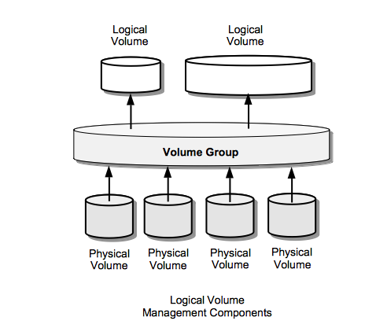

## 👋 Welcome to the Born2beRoot project
**Bu kaynak, Born2beRoot projesini yaparken öğrendiklerimi ve deneyimlerimi içermektedir.**

## 📖 Bazı Terimlerin Açıklamaları

   - **Fiziksel Makine (Physical Machine):** Gerçek donanıma sahip olan bilgisayar.
   - **Sanal Makine (Virtual Machine):** Fiziksel makine üzerinde çalışan, sanallaştırma yazılımı ile oluşturulan sanal bir bilgisayar.
   - **Hypervisor:** Sanallaştırma yazılımıdır. Fiziksel makine üzerinde çalışarak sanal makinelerin oluşturulmasını ve yönetilmesini sağlar.
   - **Sanallaştırma:** Fiziksel donanım üzerinde birden fazla işletim sistemi çalıştırılmasını sağlayan teknolojidir.
   - **Host (Ana Makine):** Hypervisor yazılımının çalıştığı fiziksel makinedir.
   - **Guest (Misafir Makine):** Hypervisor yazılımı üzerinde çalışan sanal makinelerdir.
   - **ISO Dosyası:** Bir CD veya DVD'nin birebir dijital kopyasını içeren dosya formatıdır. Genellikle işletim sistemi yüklemeleri veya yazılım dağıtımı için kullanılır. ISO dosyası, sanal makinelere veya emülatörlere bağlanarak bir disk sürücüsü gibi davranabilir.

## 📜 1. Sanallaştırma Temelleri
  - [Sanallaştırma Nedir ? AWS](https://aws.amazon.com/tr/what-is/virtualization/?utm_source=chatgpt.com)
  - [Sanallaştırma Nedir ? IBM](https://www.ibm.com/topics/virtualization)
  - [Hypervizör Nedir ?](https://aws.amazon.com/what-is/hypervisor/)
  - [Type 1 ve Type 2 Hypervisor farkları](https://aws.amazon.com/tr/compare/the-difference-between-type-1-and-type-2-hypervisors/)
  - [Belleğin Sanallaştırılması](https://www.alibabacloud.com/blog/599058)
  - [CPU'nun Sanallaştırılması](https://www.flackbox.com/virtual-processor-scheduling-how-vmware-and-microsoft-hypervisors-work-at-the-cpu-level)

## 🖴   2. Logical Volume Manager (LVM) Nasıl Çalışır ?
 Disk Yönetim sistemidir,fiziksel disklerimizi soyutlayıp onları yönetmemizi sağlar.
 LVM (Logical Volume Manager), fiziksel diskleri veya bölümleri fiziksel hacimler (Physical Volumes) olarak tanımlar ve bu hacimleri bir Volume Group (VG) adı verilen bir depolama havuzunda birleştirir. Bu havuzdan, esnek boyutlandırılabilir mantıksal hacimler (Logical Volumes) oluşturulur. Logical Volume'lar, işletim sistemi tarafından bir disk gibi algılanır ve bağlanarak (mount) kullanılabilir.

  

